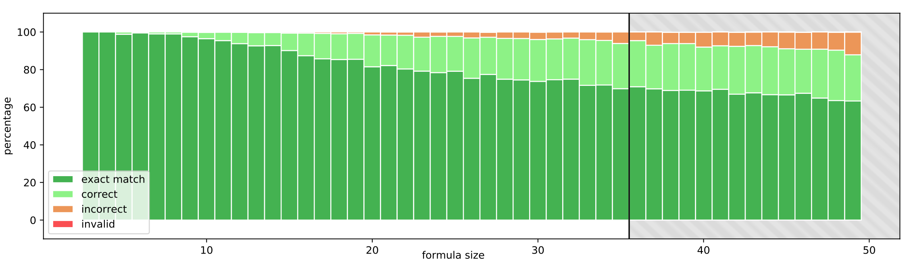
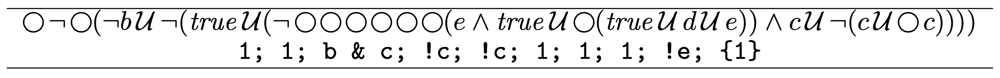

# DeepLTL

This repository is the official implementation of the ICLR'21 paper [Teaching Temporal Logics to Neural Networks](https://arxiv.org/abs/2003.04218).

We trained a Transformer to predict solutions to linear-time temporal logical (LTL) formulas. Our trained models evince powerful generalization properties, namely, the generalization to the semantics of the logic, and the generalization to larger formulas than seen during training. This repository includes 1) a data generation framework for teaching reasoning tasks on propositional logic and LTL to a Transformer and 2) a training framework with our experimental results, where our models predict solutions to propositional and LTL formulas.

**Contribution.** Generally, formulas have many solutions and the training data thus depends on the particularities of the generator.
While the Transformer does not perfectly predict the generator’s output, it still produces correct solutions to almost all formulas, even when its prediction deviates from the generator.
With this learning framework, it seems to be easier to learn the semantics of the logics than the particularities of the generator.

The Transformer preserves this semantic generalization even when challenged with formulas of a size it has never encountered before (see following picture):

Performance of our best model *(only trained on LTL formulas up to length 35)* on LTL formulas up to length 50 with a tree positional encoding. Exact syntactic matches are displayed in green, the semantic accuracy in light green and the incorrect predictions in orange. The shaded area indicates the formula sizes the model was not trained on. For more details see [Teaching Temporal Logics to Neural Networks](https://arxiv.org/abs/2003.04218).
    
Surprisingly, the Transformer solves almost all LTL formulas in our test set including those for which our generator timed out. For example, very complex formulas such as (LTL formula above, predicted satisfying trace below):


## Requirements

To install the python package, run:

```setup
pip install .
```

In addition, the LTL, automata manipulation and model checking library [Spot](https://spot.lrde.epita.fr) is required. Please follow the [download and installation instructions](https://spot.lrde.epita.fr/install.html) on their website.


## Training

To train a linear-time temporal logic model with dataset **ltl-35** for 5 epochs with default parameters, run:

```train
python -m deepltl.train.train_transformer --problem='ltl' --ds-name='ltl-35' --epochs=5
```

To train a propositional logic model with dataset **prop-35** for 5 epochs with default parameters, run:

```train
python -m deepltl.train.train_transformer --problem='prop' --ds-name='prop-35' --epochs=5
```

Below the available datasets and parameters are described.

## Evaluation

To evaluate a linear-time temporal logic model on dataset **ltl-50-test** with default parameters, run:

```eval
python -m deepltl.train.train_transformer --problem='ltl' --ds-name='ltl-50-test' --test
```

To evaluate a propositional logic model on dataset **prop-50-test** with default parameters, run:
```eval
python -m deepltl.train.train_transformer --problem='prop' --ds-name='prop-50-test' --test
```

## Datasets

- **ltl-35** 1 million LTL formulas of maximum size 35 with 5 different propositons split into a training set of 800k formulas, a validation set of 100k formulas and a test set of 100k formulas
- **ltl-50-test** a test set of 20k LTL formulas of size 35 to 50 with 5 different propositons
- **prop-35** 1 million propositional logic formulas of maximum size 35 with 5 differnt propositons split into a training set of 800k formulas, a validation set of 100k formulas and a test set of 100k formulas
- **prop-50-test** a test set of 20k propositional logic formulas of size 35 to 50 with 5 different propositons
- **prop-60-no-derived** 1 million propositional logic formulas of maximum size 60 with 10 different propositions and without derived operators (exclusive or, equivalence) split into a training set of 800k formulas, a validation set of 100k formulas and a test set of 100k formulas


## Parameter

The following parameter can be specified when training the models:

| command line argument | default   | parameter                                                    |
| --------------------- | --------- | ------------------------------------------------------------ |
| problem               | ltl       | problem (either ltl or prop)                                 |
| ds-name               | ltl-35    | dataset name                                                 |
| run-name              | default   | name of the training / testing run                           | 
| d-embed-enc           | 128       | embedding dimension encoder                                  |
| d-embed-dec           | 128       | embedding dimension decoder                                  |
| num-layers            | 4         | number of encoder/decoder layers                             |
| num-heads             | 4         | number of attention heads                                    |
| d-ff                  | 512       | dimension of fully-connected feed-forward networks           |
| ff-activation         | relu      | activation function of fully-connected feed-forward networks |
| dropout               | 0.1       | amount of dropped out units                                  |
| warmup-steps          | 4000      | number of warmup steps                                       |
| tree-pos-enc          | False     | whether to use the tree positional encoding                  |
| batch-size            | 100       | batch size                                                   |
| epochs                | 3         | number of epochs                                             |
| alpha                 | 1.0       | beam search parameter for length normalization               |
| beam-size             | 2         | beam size                                                    |


## Results

The following table shows our best performing models and the corresponing parameters:

|                    | Prop      | LTL       |
| ------------------ | --------- | --------- |
| ds-name            | prop-35   | ltl-35    |
| d-embed-enc        | 128       | 128       |
| d-embed-dec        | 64        | 128       |
| num-layers         | 6         | 8         |
| num-heads          | 6         | 8         |
| d-ff               | 512       | 1024      |
| dropout            | 0.1       | 0.1       |
| batch-size         | 1024      | 768       |
| epochs             | 64        | 48        |
| alpha              | 1.0       | 1.0       |
| beam-size          | 3         | 3         |
|                    |           |           |
| exact match        | 58.1%     | 83.8%     |
| correct            | 96.5%     | 98.5%     |


## Data Generation
### Linear-Time Temporal Logic
The **ltl-35** dataset was created by calling
```
python -m deepltl.data.generator --num-aps 5 --num-formulas 1000000 --tree-size 35 --timeout 120 --alpha 0.112
```
where `alpha` is used to tune the distribution of formulas, so that it is actually uniform in size.
For more details on available parameters, consider the help (`-h`).

### Propositional Logic
To generate a propositional logic dataset, the following additional package is required:
* `py-aiger-cnf`: simple_aig2cnf branch from https://github.com/MarkusRabe/py-aiger-cnf/tree/simple_aig2cnf

The **prop-35** dataset was created by calling
```
python -m deepltl.data.sat_generator --num-aps 5 --num-examples 1000000 --max-size 35 --alpha 0.095 --target-directory data_prop
```
Different node distributions and minimal sizes have to be set manually in the code.

## How To Cite

```
@article{deepltl,
  title    = {Teaching Temporal Logics to Neural Networks},
  author   = {Hahn, Christopher and Schmitt, Frederik and Kreber, Jens U and Rabe, Markus N and Finkbeiner, Bernd},
  journal  = {arXiv preprint arXiv:2003.04218},
  year     = {2020}
}
```
